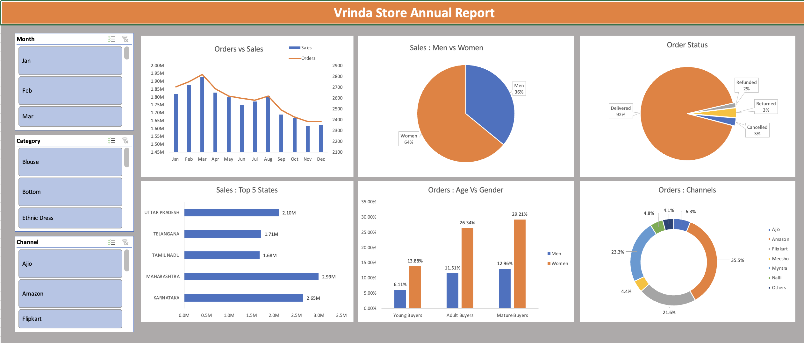

# excel-dashboard-vrinda-store-sales-analysis
Excel dashboard analyzing Vrinda Store sales data to identify customer trends, top-performing states, and high-impact sales channels for business decision-making.
# Excel Dashboard: Vrinda Store Sales Analysis

📊 Retail Sales Analysis | Excel Dashboard | Data Cleaning & Business Insights

**Skills:** Excel | Data Cleaning | Pivot Tables | Data Visualization | Business Analysis | Dashboard Design

---

## Project Summary

This project analyzes **Vrinda Store retail sales data** using **Microsoft Excel** to uncover customer purchasing patterns, identify top-performing states, and evaluate high-impact sales channels.

The analysis involves **data cleaning, pivot table analysis, and dashboard creation** to generate actionable business insights that can help Vrinda Store improve its sales strategy for the upcoming year.

---

## Dashboard Preview

---

## Business Problem

Vrinda Store wants to create an **Annual Sales Report for 2022** to better understand customer behavior and identify opportunities to grow sales in **2023**.

Retail companies often sell products across multiple states and through different online channels. Without proper analysis, it becomes difficult to determine:

- Which customers contribute the most to sales
- Which regions generate the highest revenue
- Which sales channels perform best
- Which customer demographic drives the majority of orders

This project analyzes Vrinda Store’s sales data to uncover patterns in **customer demographics, regional performance, and sales channel contributions**.

---

## Dataset Information

Dataset: **Vrinda Store Retail Sales Dataset**

The dataset contains information about orders, customers, and product sales.

Example columns include:

- Order ID
- Order Date
- Gender
- Age
- Category
- Channel
- Ship City
- Ship State
- Quantity (Qty)
- Amount (Sales)
- Order Status

Total Records: **~30,000+ rows**

Before analysis, the dataset was cleaned and structured for better analysis.

---

## Tools & Skills Demonstrated

### Tools Used

- Microsoft Excel
- Pivot Tables
- Pivot Charts
- Slicers (Interactive Filters)
- Data Cleaning techniques

### Skills Demonstrated

- Data Cleaning
- Data Exploration
- Business Data Analysis
- Dashboard Development
- Analytical Thinking
- Data Visualization

---

## Data Cleaning Process

Before performing the analysis, several data quality issues were identified and resolved.

| Column | Issue | Resolution |
|------|------|------|
| Gender | Irregular text format | Standardized using Find & Replace |
| Qty | Mixed numeric and text values | Converted to numeric |
| Ship City | Inconsistent text format | Corrected |
| Age | Difficult to analyze directly | Created Age Groups |

### Age Statistics

- Minimum Age: **18**
- Maximum Age: **78**
- Average Age: **37**

### Age Groups Created

- Young Buyers → `< 26`
- Adult Buyers → `26 – 40`
- Mature Buyers → `> 40`

---

## Analysis Questions

The following key business questions were explored:

1. Compare **sales and orders** using a single chart  
2. Identify the **month with the highest sales and orders**  
3. Determine whether **men or women purchased more in 2022**  
4. Analyze different **order statuses** in the dataset  
5. Identify the **top states contributing to total sales**  
6. Examine the **relationship between age group and gender based on orders**  
7. Identify which **sales channel contributes the most revenue**  
8. Determine the **highest selling product category**

---

## Dashboard Features

The interactive Excel dashboard includes the following views:

- Sales vs Orders monthly trend
- Sales distribution by gender
- Order status breakdown
- Top 5 states by revenue
- Orders by age group and gender
- Sales contribution by channel

Interactive filters allow users to analyze data by:

- Month
- Category
- Channel

---

## Key Insights

Important insights from the analysis include:

- **Women contribute approximately 65% of total purchases**
- **Maharashtra, Karnataka, and Uttar Pradesh** are the top-performing states contributing around **35% of sales**
- **Adult customers (30–49 years)** generate nearly **50% of total orders**
- **Amazon, Flipkart, and Myntra** together contribute approximately **80% of total sales**

---

## Business Recommendation

Based on the analysis, Vrinda Store should focus marketing efforts on:

- **Women customers aged 30–49 years**
- Customers located in **Maharashtra, Karnataka, and Uttar Pradesh**
- Promotions and campaigns on **Amazon, Flipkart, and Myntra**

Offering **ads, discounts, and promotional coupons** on these channels can help increase sales and improve business performance in the upcoming year.

---

## Project Structure
